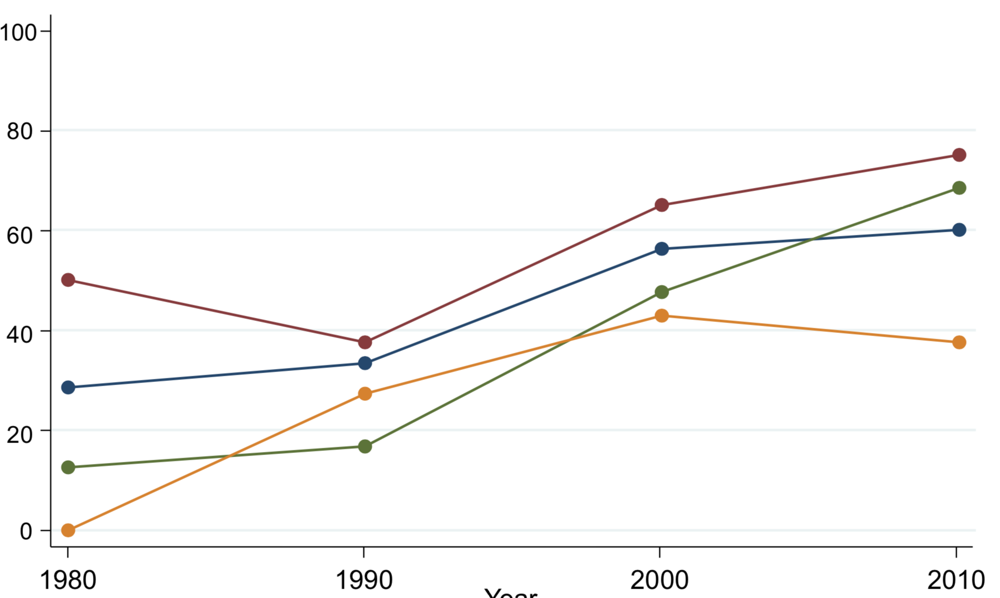

```{r setup, include=FALSE}
knitr::opts_chunk$set(echo = TRUE)
library(ggplot2)
library(tidyverse)
# The color-blind palette with black:
cbbPalette <- c("#000000", "#E69F00", "#56B4E9", "#009E73", "#F0E442", "#0072B2", "#D55E00", "#CC79A7")

```


[](https://doi.org/10.5281/zenodo.1453337)


# clone-chetty-use-admin-data
A scan of the data behind the Chetty (2012) figure

## Source

Raj Chetty. 2012. “Time Trends in the Use of Administrative Data for Empirical Research.” presented at the NBER Summer Institute. http://www.rajchetty.com/chettyfiles/admin_data_trends.pdf.

## The Figure



## The Data

- [chetty1_datasets.csv](chetty1_datasets.csv): Data as created by [WebPlot Digitizer](https://apps.automeris.io/wpd/) on 2018-07-19.
- [chetty1_increase_admin.csv](chetty1_increase_admin.csv): Reformatted
- [chetty1_increase_admin.xlsx](chetty1_increase_admin.xlsx): Reformatting tool


Data is at 
https://github.com/larsvilhuber/clone-chetty-use-admin-data, but we need the raw URL.

```{r data, error=FALSE, warning=FALSE}
raw_url <- "https://raw.githubusercontent.com/larsvilhuber/clone-chetty-use-admin-data/master/chetty1_increase_admin.csv"
chetty <- read.csv(raw_url,header=TRUE)
```

## Tools
I converted the graph using 
https://apps.automeris.io/wpd/


## Converting data to ggplot favorite

```{r convert data}
chetty2 <- gather(chetty,Journal,adminpct,AER,JPE,QJE,ECMA,-Year)
```

## Plot the data
```{r plot}
g <- ggplot(chetty2,aes(Year,adminpct,color=Journal)) + 
  geom_line()  + 
  theme_minimal() +
  theme(panel.grid.minor = element_blank()) +
  scale_colour_manual(values=cbbPalette) +
  ylab("Micro-data based articles\nusing administrative data") 
g
## Export the graph
dev.print(png,filename = "chetty_figure2.png",bg="transparent",width = 600, height=400, units = "px")
```

## Disclaimer

All errors are mine. Raj Chetty is the original creator.

