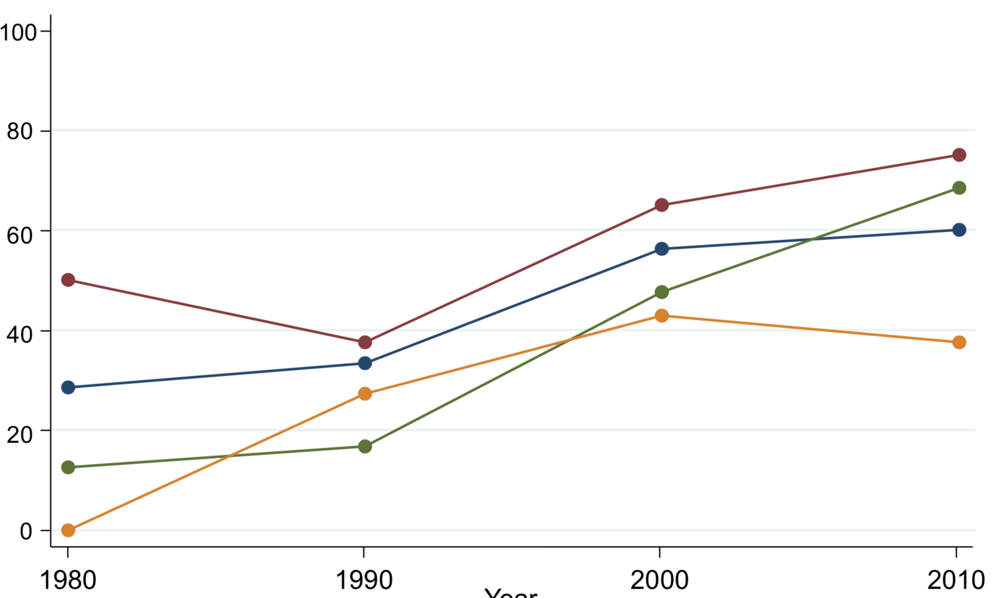

# clone-chetty-use-admin-data
A scan of the data behind the Chetty (2012) figure

## Source

Raj Chetty. 2012. “Time Trends in the Use of Administrative Data for Empirical Research.” presented at the NBER Summer Institute. http://www.rajchetty.com/chettyfiles/admin_data_trends.pdf.

## The Figure

## The Data

- [chetty1_datasets.csv](chetty1_datasets.csv): Data as created by [WebPlot Digitizer](https://apps.automeris.io/wpd/) on 2018-07-19.
- [chetty1_increase_admin.csv](chetty1_increase_admin.csv): Reformatted
- [chetty1_increase_admin.xlsx](chetty1_increase_admin.xlsx): Reformatting tool

## Tools

https://apps.automeris.io/wpd/

## Disclaimer

All errors are mine. Raj Chetty is the original creator.
